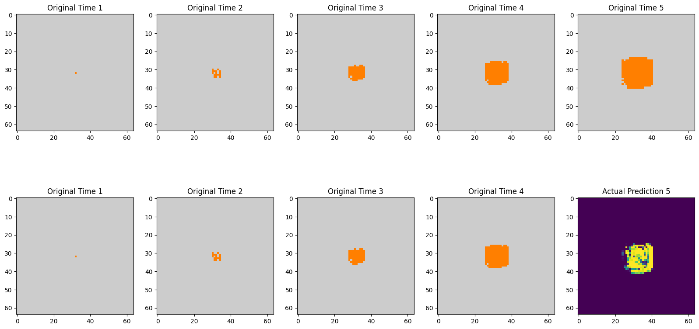

# Dataset preparation
For deep learning model training, the dataset is a CSV file. The CSV are split approximately into 2 subsets for model training (80%) and validation (20%). We use the following feature as input to train the model:

- Fire

The target output depends on how the data has been entered, if each matrix in the sequence represents one day of data, then the prediction would be for the next day based on the previous 4 days.

# Data quality

Data quality checks involve visualising examples of the dataset and generating descriptive statistics about each variables of dataset, such as mean and standard deviation so that the data can be normalised when required by the mode. Additionally this process should identify any anomlies or outliers in the dataset, which may require special attention. The readme in the data_quality folder provides further information. These checks were important since they identified that some features contained essentially the same information (e.g. NDVI & the landcore index) and allowed us to identify which features had the best overall data quality. An example single sample of data is shown below: note that not all features were used in the final model training.

# Model training

- The model, which is a combination of Convolutional Neural Networks (CNN) and Long Short Term Memory (LSTM) Neural Networks, was trained using the Adam optimization algorithm. The binary cross-entropy loss function was minimized over 20 epochs with a batch size of 5. Additionally, techniques such as early stopping and learning rate reduction were implemented to improve training efficiency.

- The input variables are sequences of 5 64x64 grayscale images. These images represent geospatial and temporal data and are processed by the Convolutional and LSTM layers of the model. The images were normalized and the data set was split into 80% for training and 20% for validation.

- The binary cross entropy loss function was optimized during training. This function is typically used in binary classification problems and is particularly suitable for this Convolutional and LSTM model.

- The model makes predictions for a period of 5 time steps. The temporal interpretation of these steps depends on how the data was entered. For example, if each array in the sequence represents one day of data, then the prediction would be for the next day based on the previous 4 days.

- To evaluate the performance of the Convolutional and LSTM model, precision and completeness (recall) metrics were used on the validation set, as well as "No-fire Precision" and "No-Fire Recall" to evaluate the model's ability to correctly predict non-fire areas.

- The binary cross-entropy loss function was used, which is consistent with the binary classification nature of the problem and the Convolutional and LSTM design of the model.
 
 - Once the Convolutional and LSTM model was trained, predictions were generated for the validation set. Precision and completeness metrics were calculated to evaluate its performance. The resulting values ​​were a precision of 82.35% and a completeness of 74.14%.

# Model evaluation

The validation data subset is utilized to assess the ConvLSTM model's performance on data. This allows us to compare the results with other models and check if the model is doign corrdtc. Below are the performance metrics.

| Metric        | Fire Precision | Fire Recall | No-Fire Precision | No-Fire Recall |
|---------------|---------------|------------|-------------------|----------------|
| ConvLSTM      | 0.92          | 0.75       | 0.99              | 0.99           |

The model pays special attention to the most recent information, as evidenced by the relationship between "Original Time 4" and "Actual Prediction 5." This feature is essential in situations where the most recent data is the most relevant for making predictions. The model's prediction, as seen in "Actual Prediction 5", appears to filter out and smooth out some of the noise present in the original images. This can be useful in identifying areas of primary interest and eliminating potential false alarms.

# Future Work

- AutoML Pipelines – Deploy AutoML pipelines to improve efficiency in model architecture and hyperparameter testing.

- Add more data: Expand the data set to improve the robustness and accuracy of the model.

- Train the model with more layers: Experiment with deeper model architectures to capture more complex features.

- Put it into production: Deploy the model in a production environment to evaluate its effectiveness in real-world scenarios.

